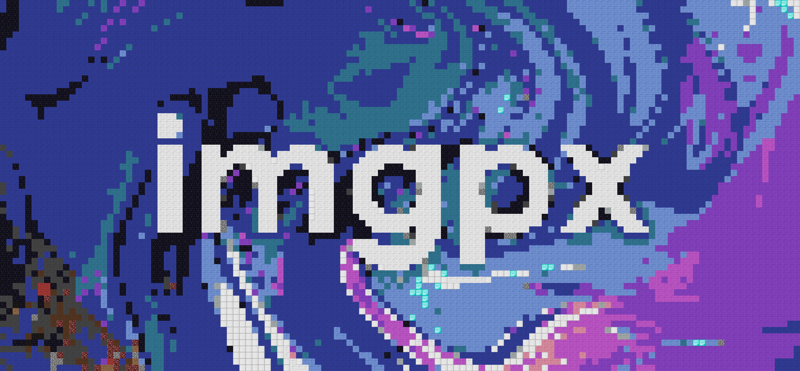
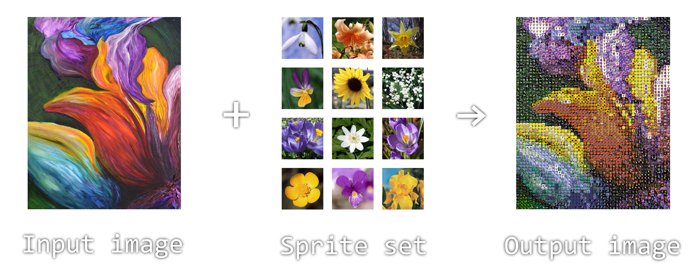

# Imgpx

Imgpx is a straightforward tool that takes an input image and a set of images (referred to as a "sprite set") and combines them to create an output image. This output image is essentially the input image constructed using the images from the sprite set.



Imgpx will first determine the average colour value for all the images in the sprite set. It will then analyze the pixels in the input image, mapping the sprite images to the pixel colours based on this calculated average colour.

# How to use
Firstly, you will can either download the binary directly from the [releases page](https://github.com/Moorad/imgpx/releases) or manually build it via cargo (Refer to the Build section below).
Then you can run `imgpx` from the command line by performing
```
imgpx [input_image] [sprite_set]
```
where
- **[input_image]**: is a relative or absolute path to the input image (including the file extension)
- **[sprite_set]**: is a relative or absolute path to a folder containing a collection of images

Other available options can be viewed using `imgpx --help`.

# Build
1. You will need to have [Rust installed](https://www.rust-lang.org/tools/install) with a rustc version of at least 1.72. I recommend installing Rust using rustup. You can verify your rust installation and rust version using:
	```
	rustc --version
	```

2. Go to your desired directory and clone the project:
	```
	git clone https://github.com/Moorad/imgpx
	```

3. Navigate to the newly cloned project folder and run:
	```
	cargo run -- [args here]
	```
	e.g.
	```
	cargo run -- mona_lisa.jpg ./flowers -o my_output.jpg
	```